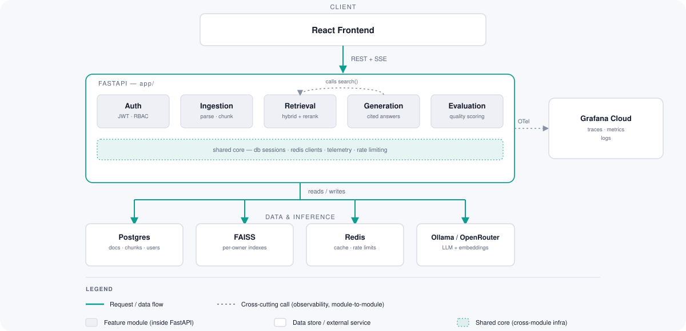
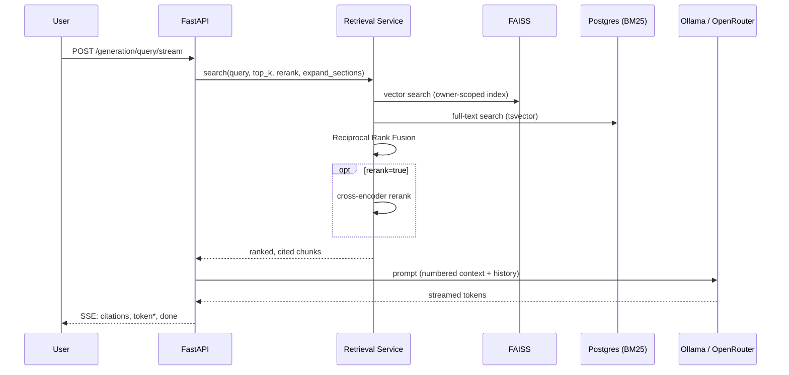

# Self-Hosted RAG Platform

A production-grade Retrieval-Augmented Generation platform built entirely on open-source, self-hostable components — FastAPI, Ollama, FAISS, and Postgres — with no dependency on paid LLM or vector database APIs.

This is not a tutorial project. It is built the way an experienced backend AI engineer would build an enterprise RAG product: feature-oriented architecture, a real service layer, migrations, tests, CI/CD, observability, and a live deployment.

> Full architecture, philosophy, and technology stack: [`docs/architecture.md`](docs/architecture.md)
> Coding standards, error handling, testing conventions: [`docs/engineering-guidelines.md`](docs/engineering-guidelines.md)
> Deployment runbook (live GCP/Neon/Upstash/Modal setup): [`docs/deployment.md`](docs/deployment.md)
> Planned features: [`docs/roadmap.md`](docs/roadmap.md)

## What It Does

Upload a document, and ask questions about it — grounded, cited, and streamed back in real time.

- **Ingestion** — PDF upload with structure-aware Markdown chunking (fast-path parser with an automatic OCR/table-extraction fallback), full provenance (page range, section path) on every chunk.
- **Hybrid Retrieval** — vector search (FAISS) fused with Postgres full-text search (BM25) via Reciprocal Rank Fusion, with optional cross-encoder reranking and structure-aware section expansion (a PageIndex-inspired retrieval mode).
- **Grounded Generation** — a local (or OpenRouter-hosted) LLM synthesizes an answer over retrieved chunks, with inline `[1]`, `[2]` citations back to source passages, and an explicit "not enough information" fallback when context is insufficient.
- **Streaming** — answers stream token-by-token over Server-Sent Events.
- **Conversation memory** — multi-turn conversations with query rewriting for follow-up questions, and full history readback.
- **Authentication** — local email/password (JWT + rotating refresh tokens), with per-user data isolation enforced at the data layer, not just the API. An OIDC login path (Google, Entra ID, Okta, Keycloak — provider-agnostic via OIDC discovery) also exists at the API level, but is not yet wired into the web UI.
- **Evaluation** — retrieval-quality (Precision@k, Recall@k, MRR) and generation-quality (LLM-as-judge via Ragas or a local-LLM fallback judge) harnesses, run against a golden dataset.
- **Observability** — OpenTelemetry traces, metrics, and logs across the full pipeline, correlated by trace ID, exportable to Grafana Cloud's free tier.
- **Web UI** — a React frontend for chat, document ingestion, and account/admin management over the API.

## Architecture

Feature-oriented modules under [`app/`](app/), each owning its own routes, service logic, schemas, and (where needed) persistence — business logic never lives in API routes.



### Request flow: asking a question



## Technology Stack

| Layer | Choice |
|---|---|
| Language | Python 3.12, TypeScript |
| Backend | FastAPI, Pydantic v2 |
| Frontend | React 19, Vite, Tailwind CSS |
| LLM inference | Ollama (self-hosted), OpenRouter (optional hosted fallback) |
| Embeddings | Nomic Embed (via Ollama) |
| Vector search | FAISS (per-tenant, on-disk indexes) |
| Keyword search | Postgres full-text search (`tsvector` + GIN) |
| Reranking | FlashRank (ONNX cross-encoder, no `torch`) |
| Relational data | PostgreSQL, SQLAlchemy 2.0, Alembic |
| Caching / rate limiting | Redis (cache-aside, fails open) |
| Auth | JWT + rotating refresh tokens, OIDC (Authlib) |
| Evaluation | Ragas, custom retrieval metrics |
| Observability | OpenTelemetry, Prometheus, Grafana, Jaeger |
| Package management | `uv` (Python), `npm` (frontend) |
| Testing | Pytest, Vitest |
| CI/CD | GitHub Actions, pre-commit, Gitleaks |

See [`docs/architecture.md`](docs/architecture.md) for the full target-state diagram and the reasoning behind each choice.

## Repository Layout

```
app/                  FastAPI application (feature-oriented modules)
  auth/                 authentication, authorization, OIDC
  core/                 db, telemetry, logging, rate limiting, shared config
  ingestion/             document upload, parsing, chunking, jobs
  embedding/             embedding client, Redis cache, FAISS index store
  retrieval/             hybrid search, fusion, reranking, section expansion
  generation/             LLM orchestration, prompts, streaming, conversation memory
  evaluation/            retrieval + generation quality harnesses
frontend/             React web UI (chat, ingestion, admin)
alembic/               database migrations
docs/                  architecture, engineering guidelines, roadmap, deployment
observability/         Prometheus + Grafana provisioning for local dev
deploy/                deployment scripts (Modal-hosted Ollama, etc.)
tests/                 Pytest suite (mirrors app/ structure)
.ai/                   AI Engineering Operating System — tickets, ADRs, session log, project memory
```

## Getting Started

### Prerequisites

- Python 3.12+, [`uv`](https://docs.astral.sh/uv/)
- Node.js 20+ (frontend)
- Docker (for local Postgres, Redis, and the observability stack)
- [Ollama](https://ollama.com/), with `nomic-embed-text` and a chat model (e.g. `qwen3` or `gemma3`) pulled locally

### Backend

```bash
uv sync
uv run pre-commit install   # activates the Gitleaks secrets-scanning hook

cp .env.example .env         # fill in AUTH_JWT_SECRET_KEY at minimum
docker compose up -d postgres redis   # add jaeger/prometheus/grafana for full observability

uv run alembic upgrade head
uv run python -m app.core.check_models   # verify configured Ollama model tags are installed

uv run uvicorn app.main:app --reload
```

API docs: `http://localhost:8000/docs`

### Frontend

```bash
cd frontend
npm install
npm run dev
```

### Tests

```bash
uv run pytest              # backend (requires Postgres + Redis running)
cd frontend && npm test    # frontend
```

## Deployment

The platform is designed for a thin, always-on host with heavy compute (LLM inference, document-parsing fallbacks) offloaded to serverless compute — never run in-process on the host. A reference live deployment (GCP `e2-micro` + Neon Postgres + Upstash Redis + Modal-hosted Ollama, all free-tier) is documented end-to-end in [`docs/deployment.md`](docs/deployment.md).

## Project Governance

This repository uses a structured AI-assisted engineering workflow, documented in [`.ai/README.md`](.ai/README.md):

- **`.ai/tickets/`** — scoped units of work, one per feature/fix
- **`.ai/adr/`** — Architecture Decision Records for significant technical choices
- **`.ai/sessions/`** — an immutable log of what was built and decided, session by session
- **`.ai/memory/`** — a living summary of current repository state

All dependencies are open-source and free to use — no paid or proprietary API is required to run this platform.
